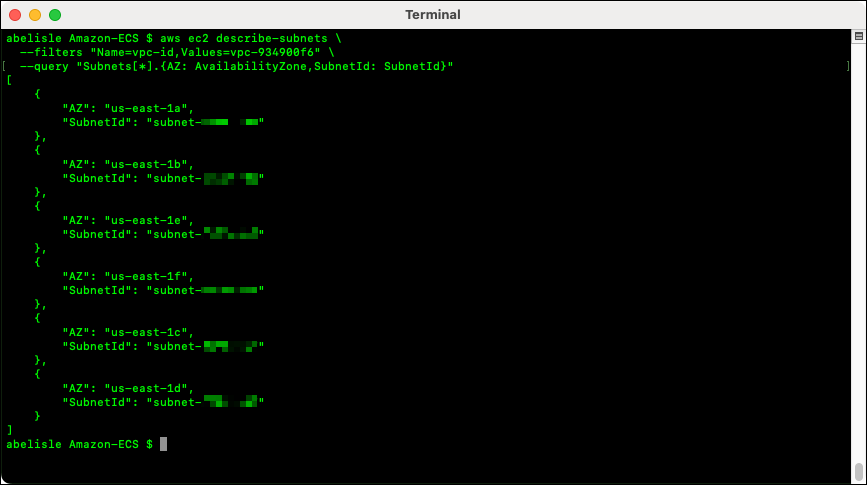
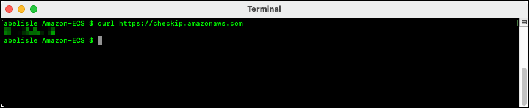
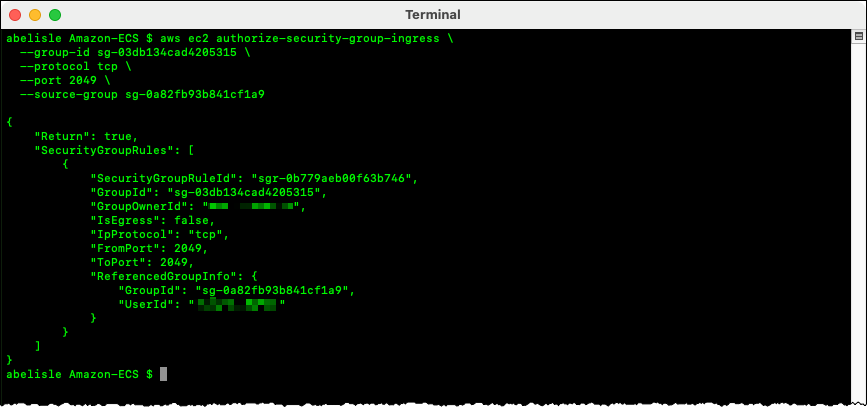
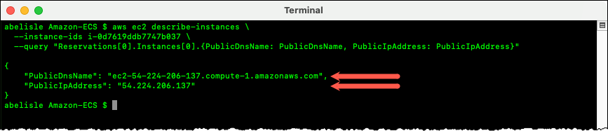
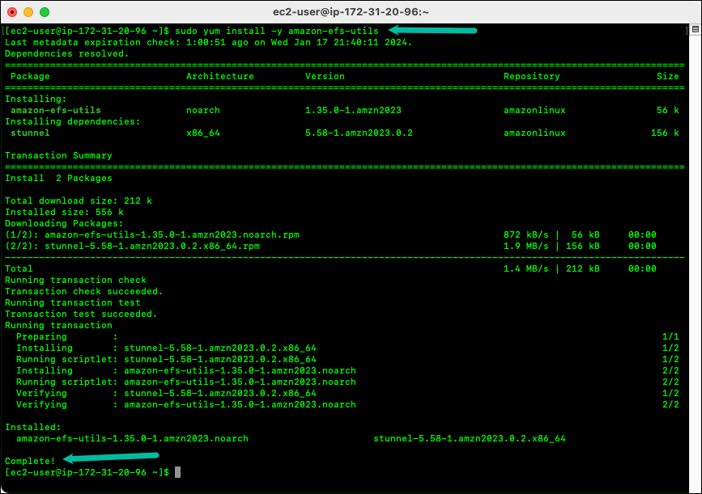
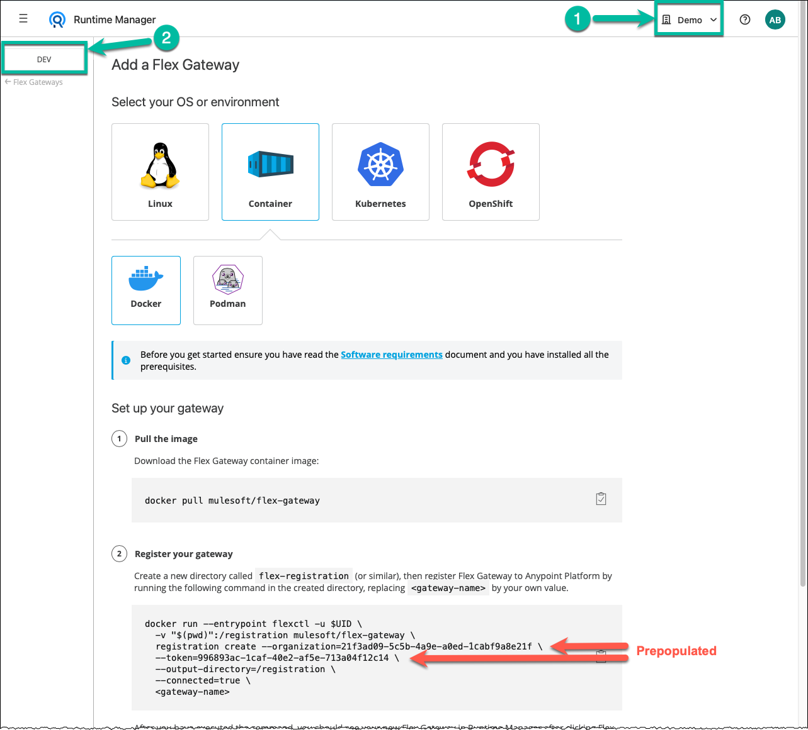

Running Anypoint Flex Gateway on Amazon ECS and AWS Fargate
===========================================================

## Table of Contents

- [Introduction](#introduction)
  - [Scope](#scope)
  - [Prerequisites](#prerequisites)
  - [Terminology](#terminology)
- [Running Flex Gateway on Amazon ECS and AWS Fargate](#running-flex-gateway-on-amazon-ecs-and-aws-fargate)
  - [Overview](#overview)
  - [Part 1 – Configure Foundational AWS Resources](#part-1-configure-foundational-aws-resources)
    - [1.1 – Gather Information](#gather-information)
    - [1.2 – Create Security Groups](#create-security-groups)
    - [1.3 – Create EFS Resources](#create-efs-resources)
    - [1.4 – Launch EC2 Instance](#launch-ec2-instance)
    - [1.5 – Mount EFS File System](#mount-efs-file-system)
    - [1.6 – Create ECS Resources](#create-ecs-resources)
  - [Part 2 – Complete Flex Gateway-Specific Tasks](#part-2-complete-flex-gateway-specific-tasks)
    - [2.1 – Register Flex Gateway Instance](#register-flex-gateway-instance)
    - [2.2 – Create an ECS Service](#create-an-ecs-service)
  - [Part 3 – Tack on High Availability](#part-3-tack-on-high-availability)
    - [3.1 – Register an API with Flex Gateway](#register-an-api-with-flex-gateway)
    - [3.2 – Add Network Load Balancer](#add-network-load-balancer)
    - [3.3 – Update ECS Service](#update-ecs-service)
- [Conclusion](#conclusion)
- [Revision History](#revision-history)

<p>&nbsp;</p>

# Introduction
This informal guide provides a suggested approach to establish a baseline or foundation for successfully deploying and running Anypoint Flex Gateway in Connected mode on Amazon Elastic Container Service (Amazon ECS) and AWS Fargate.

## Scope

This guide and the suggested approach were tested using Flex Gateway versions 1.6.0, 1.6.1, and 1.6.2 running in Connected Mode. The content should apply to Flex Gateway versions 1.5.3, 1.5.4, and future minor releases, i.e., 1.6.x. If you have experience running Flex Gateway in Local mode, most of the content still applies.

The scope is intentionally limited to establishing a baseline or minimal installation and configuration of Flex Gateway on Amazon ECS and AWS Fargate. This guide does not cover advanced topics such as creating a dedicated Virtual Private Cloud (VPC), high availability, securing and hardening AWS resources, Flex Gateway, and any APIs it manages.

> [!NOTE]
> This guide was authored on a Mac computer. If you use a Windows computer, you must adjust the commands in this guide accordingly.
> The suggested approach herein leverages the AWS Command Line Interface (CLI) for provisioning and configuring AWS resources. However, if you have experience provisioning and configuring AWS resources, you could complete all the steps using the AWS management console or leverage an Infrastructure as Code approach (IaC) using AWS Elastic Beanstalk, AWS CloudFormation, Ansible, Terraform, etc.

## Prerequisites

- You must have the AWS CLI installed and configured. Please refer to the articles [Install or update the latest version of the AWS CLI](https://docs.aws.amazon.com/cli/latest/userguide/getting-started-install.html) and [Configure the AWS CLI](https://docs.aws.amazon.com/cli/latest/userguide/cli-chap-configure.html) in the ***AWS CLI User Guide*** for more information.

- You must have sufficient privileges in your AWS account to create and configure the AWS services and resources illustrated in Figure 1, including but not limited to CloudWatch, Elastic Container Service (ECS), Elastic Compute Cloud (EC2), Elastic File System (EFS), Elastic Load Balancing (ELB) and Network Load Balancer (NLB), Fargate, Identity and Access Management (IAM), and Security Groups.

## Terminology

Before proceeding, it is essential to understand the following terminology used in the context of this document.

|   |   |
| - | - |
| **Flex Gateway Instance** | An instance is a logical entity that groups one or more Flex Gateway replicas. When adding Flex Gateway to Anypoint Runtime Manager, you register a new Flex Gateway instance using the `flexctl` utility, which outputs a registration file. The content of the registration file is specific to the instance you registered and the Anypoint organization or business group and environment where you registered it. |
| **Flex Gateway Replica**  | A replica is a runtime unit or a copy of Flex Gateway running on a supported operating system or infrastructure (e.g., Docker, Podman, Kubernetes, OpenShift). You associate replicas to an instance by running Flex Gateway using the same registration file. You run two or more replicas for each Flex Gateway instance to achieve high availability. |

# Running Flex Gateway on Amazon ECS and AWS Fargate

To run Flex Gateway on Amazon ECS and AWS Fargate, you need to provision and configure several AWS resources and complete tasks specific to Flex Gateway. The following diagram illustrates a suggested architecture and establishes a baseline or foundation for running Flex Gateway on Amazon ECS and AWS Fargate.


**Figure 1 – Flex Gateway on Amazon ECS and AWS Fargate Baseline Architecture**

As illustrated in Figure 1, this guide leverages the AWS `us-east-1` region and four availability zones. Naturally, you can use any other AWS region and any number of availability zones to meet your requirements.

## Overview

This document guides you through the following suggested approach:
- First, provision and configure foundational AWS resources.
- Then, complete Flex Gateway-specific tasks, including starting a single replica.
- Finally, focus on redundancy.


## Part 1 – Configure Foundational AWS Resources

In Part 1, you provision and configure the minimum required AWS resources to run a single Flex Gateway replica. When considering this goal, one of the challenges is making the Flex Gateway registration file available to the containers. When using Docker, for example, you typically store the registration file in a folder on the host computer, which you mount as a volume when starting the Flex Gateway replica. There is no host computer to store data when using the AWS Fargate launch type for an ECS cluster, as Fargate is a serverless service as a reminder. One approach is to mount data volumes to containers since Amazon ECS supports a few options that work with the Fargate launch type. Another approach is to add the Flex Gateway registration file to the Docker image, which means you would need to maintain one Docker image per Flex Gateway instance.

As implied in Figure 1, this guide leverages the first approach and Amazon Elastic File System (EFS). An EFS file system stores the Flex Gateway registration and configuration files and is mounted when starting a Flex Gateway replica.

> For more information about using volumes with Amazon ECS, please refer to the article [Using data volumes in tasks](https://docs.aws.amazon.com/AmazonECS/latest/developerguide/using_data_volumes.html) in the ***Amazon Elastic Container Service Developer Guide***.

Using Amazon EFS is not without its challenges, though. For example, there is no easy way to create folders or upload files to the EFS file system. A few techniques exist to transfer data into and out of Amazon EFS file systems. Arguably, the most straightforward approach is to mount an EFS file system to an Amazon Elastic Compute Cloud (EC2) instance, as illustrated in Figure 1.

> [!TIP]
> Using EC2 instances to manage other AWS resources in a VPC is a common technique. Hence, the reason why I am inclined to take this approach. Also, it is a best practice when securing and hardening resources, and the EC2 instance, in such cases, is commonly known as a bastion host, jump box, or jump server.

> For more information about techniques to store and retrieve data from Amazon EFS, Please refer to the article [Transferring data into and out of Amazon EFS](https://docs.aws.amazon.com/efs/latest/ug/transfer-data-to-efs.html) in the ***Amazon Elastic File System User Guide***.


### 1.1 – Gather Information

First, gathering some basic information required to provision and configure resources is useful. As stated in the [Prerequisites](#prerequisites) section, you must have the AWS CLI installed and configured before proceeding with the following steps.

#### 1.1.1 – Get AWS Account ID

- To retrieve your AWS account id, open a terminal (Linux or Mac), and execute the following AWS CLI command.

  ```bash
  aws sts get-caller-identity
  ```

  

- Copy and save your AWS account ID, as you will need it in the upcoming steps. I refer to this value as `<AWS Account ID>` throughout this guide.

#### 1.1.2 – Get VPC ID

- Optionally, resuming from the previous step, execute the following AWS CLI command to confirm the AWS CLI interacts with the correct AWS region. I typically work in the `us-east-1` region as a force of habit.

  ```bash
  aws configure get region
  ```

  

- Copy and save this value, as you will need it in several upcoming steps. I refer to this value as `<AWS Region Name>` throughout this guide.

> [!NOTE]
> As a reminder, you typically set the default region the AWS CLI interacts with when configuring it, as implied in the command above. Feel free to work in a different AWS region, but make sure the AWS CLI is configured accordingly.

- If you have not created any VPC, you can execute the following AWS CLI command to see all the information related to it.

  ```bash
  aws ec2 describe-vpcs
  ```

  

- Copy and save the value of the `VpcId` property, as you will need it in the upcoming steps. I refer to this value as `<VPC ID>` throughout this guide.

> [!NOTE]
> The screen capture above implies the VPC is the default one – i.e., AWS created it when I originally opened my account.

- If you have multiple VPCs in the region you picked, you will get pages of information. Alternatively, you can limit the outputs by using the `--query` option as illustrated in the following example.

  ```bash
  aws ec2 describe-vpcs \
    --query "Vpcs[*].[VpcId,IsDefault,Tags[*].Key,Tags[*].Value]"
  ```

  

- Copy and save the ID of your preferred VPC, as you will need it in the upcoming steps. As stated before, I refer to this value as `<VPC ID>` throughout this guide.

> Tip: The `--query` option accepts a string value, which represents a JMESPath query used for filtering the response data. Please refer to the [JMESPath website](https://jmespath.org/) to learn more about it.

#### 1.1.3 – Get Subnets ID

- Execute the following AWS CLI command to get the id of all subnets.

- Replace `<VPC ID>` with the value copied from the previous step.

  ```bash
  aws ec2 describe-subnets \
    --filters "Name=vpc-id,Values=<VPC ID>" \
    --query "Subnets[*].{AZ: AvailabilityZone,SubnetId: SubnetId}"
  ```

  

- Copy the value of all `SubnetId` properties, or only the ones you plan on using, and save them, as you will need them in the upcoming steps. As implied in Figure 1, I am arbitrarily leveraging four availability zones within the `us-east-1` region (i.e., A, B, C, and D) in this guide. I refer to these values as `<Subnet ID A>`, `<Subnet ID B>`, `<Subnet ID C>`, and `<Subnet ID D>` throughout this guide.

### 1.2 – Create Security Groups

Now that you have gathered the information required to provision and configure resources using the AWS CLI, you create two security groups.

- The first secures all resources within your VPC – e.g., secures access to your EC2 instance and ECS cluster.

- The second enables mounting your EFS file system to your EC2 instance and containers running in ECS.

**Before you begin, make sure you have the following information:**

- `<VPC ID>` – You retrieved and saved this value in ***step 1.1.2***.

#### 1.2.1 – Create Security Group for All Resources

When provisioning resources for a new project, proof of concept, or demo, I typically create a security group with a single ingress rule that grants access to my IP address on all protocols and ports. Once completed provisioning and configuring resources, I circle back and fine-tune security in my VPC. And that is what I am suggesting in this guide. Naturally, you can ignore my approach and configure this security group to meet your needs.

- Execute the following command to find your IP address.

  ```bash
  curl https://checkip.amazonaws.com
  ```

  

- Copy and save this value, as you will need it in an upcoming step. Naturally, I refer to this value as `<Your IP address>` throughout this guide.

- Execute the following AWS CLI command to create the security group.
  - Replace `<VPC ID>` with the value copied from ***step 1.1.2***.
  - Optionally change the name, description, and tag.

  ```bash
  aws ec2 create-security-group \
    --group-name flex-gw-on-ecs-sg \
    --description "Security group for Flex Gateway on ECS" \
    --vpc-id <VPC ID> \
    --tag-specifications 'ResourceType=security-group,Tags=[{Key=Project,Value=Flex on ECS}]'
  ```

  

- Copy and save the `GroupId`, as you will need it in several upcoming steps. I refer to this value as `<Security Group for All Resources>` throughout this guide.

- Execute the following AWS CLI command to add a single ingress rule that grants your IP address access to all protocols and all ports.
  - Replace `<Security Group for All Resources>` and `<Your IP Address>` with the values you copied from previous steps.

  ```
  aws ec2 authorize-security-group-ingress \
    --group-id <Security Group for All Resources> \
    --protocol all \
    --cidr <Your IP Address>/32
  ```

  

You are done creating and configuring the first security group.

#### 1.2.2 – Create Security Group for EFS File System

The second security group is different because the source is not an IP address but the security group you just created. The ingress rule you add enables all resources associated with the first security group (e.g., EC2 instance, containers running in ECS) to mount and access the ECS file system.

- Like what you did in the previous steps, execute the following AWS CLI command to create the second security group.
  - Replace `<VPC ID>` with the value copied from ***step 1.1.2***.
  - Optionally change the name, description, and tag.

  ```bash
  aws ec2 create-security-group \
    --group-name flex-gw-efs-sg \
    --description "Security group for EFS file system" \
    --vpc-id <VPC ID> \
    --tag-specifications 'ResourceType=security-group,Tags=[{Key=Project,Value=Flex on ECS}]'
  ```

  

- Copy and save the `GroupId`, as you will need it in a few upcoming steps. I refer to this value as `<EFS File System Security Group>` throughout this guide.

- Execute the following AWS CLI command to add a single ingress rule that grants the first security group (i.e., `<Security Group for All Resources>`) access to the Network File System (NFS) protocol, which you use to mount the EFS file system to EC2 instances and containers running in ECS.
  - Replace `<EFS File System Security Group>` and `<Security Group for All Resources>` with the values you copied from previous steps.

  ```bash
  aws ec2 authorize-security-group-ingress \
    --group-id <EFS File System Security Group> \
    --protocol tcp \
    --port 2049 \
    --source-group <Security Group for All Resources>
  ```

  

You are done creating and configuring the required security groups.

### 1.3 – Create EFS Resources

Now that you have the two security groups, you create three EFS resources:

- First, you create an EFS file system to store the Flex Gateway registration file and any optional and additional configuration files. In this guide, you create a regional file system that offers the highest levels of availability and durability. As described in the article [Creating Amazon EFS file systems](https://docs.aws.amazon.com/efs/latest/ug/creating-using-create-fs.html), a regional file system stores file system data and metadata redundantly across all availability zones within the region. Naturally, you could create a one zone file system to lower cost for a POC as an example. As the name implies, a one zone file system stores file system data and metadata redundantly within a single availability zone.

- Then, you create mount targets to access the EFS file system. As described in the article [Amazon EFS: How it works](https://docs.aws.amazon.com/efs/latest/ug/how-it-works.html), you create one or more mount targets to access an Amazon EFS file system. A mount target exposes the file system as a resource within a subnet with a DNS name and IP address (e.g., `fs-064bd9f7c7079efc7.efs.us-east-1.amazonaws.com`). For a regional file system, you must create a mount target in each availability zone where you will run containers in ECS. As implied in Figure 1, I arbitrarily picked availability zones A, B, C, and D within the `us-east-1` region.

**Before you begin, make sure you have the following information:**

- `<Subnet ID>` – You retrieved and saved the subnet id of a subset or all availability zones in ***step 1.1.3***. Feel free to use any of them, but I arbitrarily use availability zone A and its subnet in this section.

- `<EFS File System Security Group>` – You created this security group and saved its `GroupId` in ***step 1.2.2***.

#### 1.3.1 – Create EFS File System

First, you create an EFS file system to store the Flex Gateway registration file and any optional and additional configuration files.

- Execute the following AWS CLI command to create the EFS file system.
  - Optionally change the region and tags.

  ```bash
  aws efs create-file-system \
    --creation-token Flex-Gateway-FS \
    --backup \
    --performance-mode generalPurpose \
    --throughput-mode elastic \
    --region us-east-1 \
    --tags \
      Key=Name,Value="Flex Gateway File System" \
      Key=Project,Value="Flex on ECS" \
    --no-cli-pager
  ```

  

- Copy and save the `FileSystemId`, as you will need it in the next step and a few others. I refer to this value as `<EFS File System ID>` throughout this guide.

> [!NOTE]
> I intentionally enabled automatic backups on the file system. Also, the command above implies two settings you may want to adjust as needed. First, it creates a file system available across the specified region (and all its availability zones). Second, the file system is not encrypted. For a proof of concept, I typically 1) specify a single availability zone and 2) turn off automatic backups to lower costs.

> For more information about the `aws efs create-file-system` command, please refer to the [AWS CLI Command Reference guide](https://awscli.amazonaws.com/v2/documentation/api/latest/reference/efs/create-file-system.html).

#### 1.3.2 – Create EFS Mount Target

In the context of this guide, you create mount targets for 1) mounting the EFS file system on an EC2 instance, and 2) mounting the EFS file system to containers running in ECS. As stated before, you must create a mount target in each availability zone where you will run containers in ECS.

- Execute the following AWS CLI command to create a mount target.
  - Replace `<EFS File System ID>`, `<Subnet ID A>`, and `<EFS File System Security Group>` with the values you copied from previous steps.

  ```bash
  aws efs create-mount-target \
    --file-system-id <EFS File System ID> \
    --subnet-id <Subnet ID A> \
    --security-group <EFS File System Security Group> \
    --no-cli-pager
  ```

  

- Execute the AWS CLI command above three more times to create a mount target in `<Subnet ID B>`, `<Subnet ID C>`, and `<Subnet ID D>`.

You are done creating and configuring the required EFS resources.

### 1.4 – Launch EC2 Instance

As mentioned before, I leverage an EFS file system to store the Flex Gateway registration and configuration files and an EC2 instance to manage the content of the EFS file system. In my humble opinion, it is the most straightforward approach to creating folders and uploading files to the EFS file system.

**Before you begin, make sure you have the following information:**

- `<Security Group for All Resources>` – You created this security group and saved its `GroupId` in ***step 1.2.1***.

- `<Subnet ID A>` – You retrieved and saved the subnet id of a subset or all availability zones in ***step 1.1.3***. As per Figure 1, I arbitrarily launch my EC2 instance in availability zone A and I use its subnet in this section.

#### 1.4.1 – Create an EC2 Key Pair

Feel free to skip this step if you already have an Amazon EC2 key pair.

- Execute the following AWS CLI command to create a new key pair.
  - Replace `<Key Pair Name>` and `<Key Pair Filename>` with your own values.

  ```bash
  aws ec2 create-key-pair \
    --key-name <Key Pair Name> \
    --query KeyMaterial \
    --tag-specifications 'ResourceType=key-pair,Tags=[{Key=Project,Value=Flex on ECS}]' \
    --output text > <Key Pair Filename>
  ```

  

- Save your `<Key Pair Name>` and `<Key Pair Filename>`, as you will need them in the next and future steps.

- Next, AWS requires you restrict permissions on the key file by executing the following command.
  - Replace `<Key Pair Filename>` with your own value.

  ```bash
  chmod 400 <Key Pair Filename>
  ```

  

#### 1.4.2 – Launch EC2 Instance

I typically use Amazon Linux when launching a new EC2 instance, as AWS argued it is optimized for AWS. As of the time of this writing, I leveraged the Amazon Linux 2023 AMI (ami-0005e0cfe09cc9050, 64-bit, x86, uefi-preferred).

- Execute the following AWS CLI command to launch a new EC2 Instance.
  - Replace `<Key Pair Name>`, `<Security Group for All Resources>`, and `<Subnet ID>` with the values you picked or copied in previous steps.

  ```bash
  aws ec2 run-instances \
    --image-id ami-0005e0cfe09cc9050 \
    --instance-type t2.micro \
    --key-name <Key Pair Name> \
    --security-group-ids <Security Group for All Resources> \
    --subnet-id <Subnet ID A> \
    --tag-specifications \
      'ResourceType=instance,Tags=[{Key=Name,Value=Flex Gateway Jumpbox},{Key=Project,Value=Flex on ECS}]' \
    --count 1 \
    --query "Instances[0].{InstanceId: InstanceId}"
  ```

  

- Copy the `InstanceId` and save it, as you need it in the next two steps. I refer to this value as `<EC2 Instance ID>` throughout this guide.

> [!NOTE]
> As a force of habit, I picked a `t2.micro` instance type (1 vCPU, 1 GiB Memory). As a reminder, the sole purpose of this EC2 instance is to make it easier to interact with the EFS file system – e.g., create directories and copy files. A `t2.nano` instance type (1 vCPU, 0.5 GiB Memory) should be sufficient for this purpose.

- Unfortunately, the output of the `aws ec2 run-instances` command does not include the public DNS name and IP address of the EC2 instance. Execute the following AWS CLI command to retrieve those values.
  - Replace `<EC2 Instance ID>` with the value you copied from the previous step.

  ```bash
  aws ec2 describe-instances \
    --instance-ids <EC2 Instance ID> \
    --query "Reservations[0].Instances[0].{PublicDnsName: PublicDnsName, PublicIpAddress: PublicIpAddress}"
  ```

  

- Copy both values and save them, as you need either one to connect to your EC2 instance in the upcoming steps. I refer to these values as `<EC2 Instance DNS Name>` and `<EC2 Instance IP Address>` throughout this guide.

You are done launching and configuring the EC2 instance.

### 1.5 – Mount EFS File System

Next, you mount the EFS file system to the EC2 instance and, optionally, create a subdirectory to store your Flex Gateway registration file and any optional and additional configuration files.

**Before you begin, make sure you have the following information:**

- `<Key Pair Filename>` – You created the EC2 key pair in ***step 1.4.1***.
- `<EC2 Public DNS name>` – You created the EC2 instance and saved its `PublicDnsName` and `PublicIpAddress` in ***step 1.4.2***.
- `<EFS File System ID>` – You created the EFS file system and saved its `FileSystemId` in ***step 1.3.1***.

#### 1.5.1 – Install Amazon EFS Client

Unfortunately, before you can mount the EFS file system to the EC2 instance, you need to install the Amazon EFS client (a.k.a., `amazon-efs-utils` package). AWS supports a few approaches for installing it, but the most straightforward approach is to install it manually.

> For more information about installing the Amazon EFS client, please refer to the article [Using the amazon-efs-utils tools](https://docs.aws.amazon.com/efs/latest/ug/using-amazon-efs-utils.html) in the ***Amazon Elastic File System User Guide***.

- First, in a new terminal, execute the following command to connect to the EC2 instance via Secure Shell (SSH).
- Replace `<Key Pair Filename>` and `<EC2 Public DNS name>` with the values you copied in previous steps.

  ```bash
  ssh -i \<Key Pair Filename\> ec2-user@\<EC2 Public DNS name\>
  ```

  

> [!NOTE]
> `ec2-user` is the default user for an EC2 instance running Amazon Linux. Adjust the command above appropriately if you picked a different AMI and Linux distribution.

- The SSH command prompts you to confirm the connection if it is the first time you connect to the EC2 instance. Reply `yes`, and it will connect and store the host and its key as trusted for future connections.

  

You are now connected to the EC2 instance.

- Although optional, as per Linux sysadmin best practices, execute the following command to update all packages before installing new ones.

  ```bash
  sudo yum update -y
  ```

  

- Execute the following command to install the `amazon-efs-utils` package.

  ```bash
  sudo yum install -y amazon-efs-utils
  ```

  

> [!NOTE]
> Refer to the article Installing the [Amazon EFS client on other Linux distributions](https://docs.aws.amazon.com/efs/latest/ug/installing-amazon-efs-utils.html#installing-other-distro) in the ***Amazon Elastic File System User Guide*** if you picked another Linux distribution when launching the EC2 instance.

#### 1.5.2 – Mount EFS File System

The suggested approach is to create a subdirectory in the current user's home directory to hold all things related to a Flex Gateway instance, including the EFS file system mount point.

- Resuming from the previous steps, execute the following command.

  ```bash
  mkdir -p ~/flex/efs-mount-point
  ```

  

> [!NOTE]
> I use `/home/ec2-user/flex/efs-mount-point` in this guide as the absolute path to access and interact with the EFS file system, but feel free to use a different one. Also, I refer to this value as `<EC2 Local Mount Point>` throughout this guide.

- Next, edit the `/etc/fstab` file with a text editor to mount the EFS file system. Using this approach ensures it is remounted automatically when the EC2 instance reboots. For example:

  ```bash
  sudo vi /etc/fstab
  ```

  

- Then, add the following line at the end of the file.
  - Replace `<EFS File System ID>` and `<EC2 Local Mount Point>` with the values you picked or copied in previous steps.

  ```bash
  <EFS File System ID>:/ <Local Mount Point> efs _netdev,noresvport,tls 0 0
  ```

  

- Finally, execute the following command to mount the newly added entry in the system's filesystem table.

  ```bash
  sudo mount -av
  ```

  

If you configured everything correctly, the system mounts the EFS file system – e.g., security groups, EFS mount target, etc. However, the root user owns the mount point by default.

  

This means you cannot write to the EFS file system.

- Execute the following command to change the mount point’s ownership.

  ```bash
  sudo chown ec2-user:ec2-user flex/efs-mount-point
  ```

  

> [!NOTE]
> Naturally, you could change permissions for the group and others instead of ownership (i.e., `sudo chmod go+w flex/efs-mount-point` or `sudo chmod 777 flex/efs-mount-point`).

- Do not end your SSH session or close the terminal, as you will need it to complete the next steps.

#### 1.5.3 – (Optional) Create Subdirectory

It is not uncommon to have multiple Flex Gateway instances in the same AWS VPC. For example, I could have an instance for each non-prod environment (e.g., Dev, Test, and QA) within the same VPC instead of provisioning the required resources to run Flex Gateway multiple times. In such a scenario, I recommend leveraging a distinct subdirectory on the EFS file system to store the registration and configuration files for a given Flex Gateway instance. For a proof of concept or demo, that is typically not necessary.

Regardless, I like to name those subdirectories the same as the Flex Gateway instance. First, my typical Flex Gateway naming convention is as follows.

`flex-gw-<business group>-<environment>-<serial #>`

- `<business group>` represents the name of the Anypoint business group where I registered the instance.
- `<environment>` represents the environment in Anypoint Platform where I registered the instance.
- `<serial #>` is a two-digit number (starting at 01) I add just in case I end up registering multiple instances within the same Anypoint business group and environment.

As examples, the Flex Gateway instances I use for demos are typically named `flex-gw-demo-dev-01` and `flex-gw-demo-prod-01`. Therefore, assuming I deploy both Flex Gateway instances in the same AWS VPC, I would create two subdirectories in my EFS file system named `flex-gw-demo-dev-01` and `flex-gw-demo-prod-01`.

- If you ended your SSH session or closed the terminal, execute the following command in a new terminal to reconnect to the EC2 instance via Secure Shell (SSH).
  - Replace `<Key Pair Filename>` and `<EC2 Public DNS name>` with the values you copied in previous steps.

  ```bash
  ssh -i <Key Pair Filename> ec2-user@<EC2 Public DNS name>
  ```

- Next, create a subdirectory within the EFS file system mount point – i.e., `/home/ec2-user/flex/efs-mount-point` or `~/flex/efs-mount-point` in this guide. As an example:

  ```bash
  mkdir `~/flex/efs-mount-point/flex-gw-demo-dev-01`
  ```

  

You can end your SSH session as you no longer need it.

In **Part 2** of this guide, I will upload the registration file of a new Flex Gateway instance (named `flex-gw-demo-dev-01`) to this subdirectory. For convenience, I refer to this subdirectory as `<Flex GW Home>` for the remainder of this guide.

### 1.6 – Create ECS Resources

You are finally ready to create the ECS cluster and other required resources.

- First, you create a CloudWatch log group, which is required to forward the ECS containers' log information to CloudWatch Logs.
- Then, you need to create an ECS task execution role in AWS Identity and Access Management (IAM), which grants the ECS containers and Fargate agents permission to make AWS API calls – e.g., forward logs to CloudWatch Logs.
- Next, you create the ECS cluster. As defined in the article [What is AWS Fargate?](https://docs.aws.amazon.com/AmazonECS/latest/userguide/what-is-fargate.html) of the ***Amazon Elastic Container Service Developer Guide***, an ECS cluster is a logical grouping of tasks and services that you can use to isolate applications.
- Finally, you create an ECS task definition. As defined in the article [What is AWS Fargate?](https://docs.aws.amazon.com/AmazonECS/latest/userguide/what-is-fargate.html) of the ***Amazon Elastic Container Service Developer Guide***, an ECS task definition is a JSON file that describes one or more containers that form your application. You can use an ECS service to run and maintain a desired number of tasks simultaneously in an Amazon ECS cluster.

**Before you begin, make sure you have the following information:**

- `<EFS File System ID>` – You created the EFS file system and saved its `FileSystemId` in **step 1.3.1**.
- `<Flex GW Home>` – Optional – **Step 1.5.3** was optional but if you completed it, you created a subdirectory on the EFS file system and saved its name.

#### 1.6.1 – Create CloudWatch Log Group

First, you create a CloudWatch log group for Flex Gateway on Amazon ECS.

- In a terminal (Linux or Mac), execute the following AWS CLI command to create the log group.

  ```bash
  aws logs create-log-group --log-group-name <Log Group Name>
  ```

  

As implied in the screen capture, I prefix the log group name with the AWS service that sends the log and, in this case, I append the name of my Flex Gateway instance. Feel free to use any convention you prefer. However, note that I refer to this value as `<Log Group Name>` throughout this guide.

#### 1.6.2 – Create ECS Task Execution Role

Next, you create a task execution role in IAM to grant the Flex Gateway containers and Fargate agents permission to make AWS API calls, such as sending logs to CloudWatch Logs.

As discussed in the article [Amazon ECS task execution IAM role](https://docs.aws.amazon.com/AmazonECS/latest/developerguide/task_execution_IAM_role.html) of the ***Amazon Elastic Container Service Developer Guide***, “Amazon ECS provides a managed policy named `AmazonECSTaskExecutionRolePolicy` that contains the permissions for everyday use cases. In this guide, I leverage this managed policy as it meets the requirements for running Flex Gateway in ECS, Furthermore, I follow (as-is) the steps provided in the subsection ***To create a task execution IAM role (AWS CLI)*** of the [Amazon ECS task execution IAM role](https://docs.aws.amazon.com/AmazonECS/latest/developerguide/task_execution_IAM_role.html) article in the ***Amazon Elastic Container Service Developer Guide*** to create the task execution role.

- Create a file named `ECS-Tasks-Trust-Policy.json` that contains the following trust policy.

  ```json
  {
    "Version": "2012-10-17",
    "Statement": [
      {
        "Sid": "",
        "Effect": "Allow",
        "Principal": {
          "Service": "ecs-tasks.amazonaws.com"
        },
        "Action": "sts:AssumeRole"
      }
    ]
  }
  ```

- In a terminal (Linux or Mac), execute the following AWS CLI command to create an IAM role named `ECSTaskExecutionRole` using the trust policy created in the previous step.
  - If needed, update the `file` option to include the path of the `ECS-Tasks-Trust-Policy.json` file.

  ```bash
  aws iam create-role \
    --role-name ECSTaskExecutionRole \
    --assume-role-policy-document file://ECS-Tasks-Trust-Policy.json \
    --tags Key=Project,Value="Flex on ECS"
  ```

  

Copy and save the value of the `Arn` property, as you will need it in an upcoming step. I refer to this value as `<Execution Role ARN>` throughout this guide.

- Finally, execute the following AWS CLI command to attach the AWS managed `AmazonECSTaskExecutionRolePolicy` policy to the `ECSTaskExecutionRole` role you just created.

  ```bash
  aws iam attach-role-policy \
    --role-name ECSTaskExecutionRole \
    --policy-arn arn:aws:iam::aws:policy/service-role/AmazonECSTaskExecutionRolePolicy
  ```

  

#### 1.6.3 – Create an ECS Cluster

Then, you create an ECS cluster for Flex Gateway. In the context of this guide, you run a single Flex Gateway instance (with multiple replicas). Therefore, you only need a single ECS cluster. Nothing prevents us from running multiple Flex Gateway instances within the same ECS cluster. Similarly, no hard rule prevents us from running a single Flex Gateway instance per ECS cluster.

- In a terminal (Linux or Mac), execute the following AWS CLI command to create an ECS cluster named `Flex-GW-ECS-Cluster`.

  ```bash
  aws ecs create-cluster \
    --cluster-name Flex-GW-ECS-Cluster \
    --tags key=Project,value="Flex on ECS"
  ```


> [!NOTE]
> I named my ECS cluster `Flex-GW-ECS-Cluster` in this guide, but feel free to name it differently. Also, I refer to this value as `<ECS Cluster Name>` throughout this guide.

#### 1.6.4 – Create an ECS Task Definition

Finally, you first create a JSON file to contain your ECS task definition, which describes how to run the Flex Gateway Docker image, mount your EFS file system, send logs to CloudWatch Logs, etc. As many settings within the task definition are specific to a Flex Gateway instance, my typical file naming convention is as follows.

`ECS-Task-Def-<Flex Instance Name>.json`

- Create a JSON file that contains the following ECS task definition and name the file as you see fit.
  - Replace `<Flex Instance Name>`, `<Execution Role ARN>`, `<Log Group Name>`, `<EFS File System ID>`, and `<Flex GW Home>` with the values you picked or copied in previous steps.
  - Optionally change the AWS region and Flex Gateway container and host ports.

  ```json
  {
    "family": "<Flex Instance Name>-Task-Def",
    "networkMode": "awsvpc",
    "executionRoleArn": "<Execution Role ARN>",
    "containerDefinitions": [
      {
        "name": "flex-gateway",
        "image": "docker.io/mulesoft/flex-gateway:latest",
        "portMappings": [
          {
            "containerPort": 8081,
            "hostPort": 8081,
            "protocol": "tcp"
          },
          {
            "containerPort": 8082,
            "hostPort": 8082,
            "protocol": "tcp"
          }
        ],
        "essential": true,
        "mountPoints": [
          {
            "sourceVolume": "FlexEFSVolume",
            "containerPath": "/usr/local/share/mulesoft/flex-gateway/conf.d",
            "readOnly": true
          }
        ],
        "logConfiguration": {
          "logDriver": "awslogs",
          "options": {
            "awslogs-group": "<Log Group Name>",
            "awslogs-region": "us-east-1",
            "awslogs-stream-prefix": "flex-gw"
          }
        },
        "healthCheck": {
          "command": [
            "CMD-SHELL",
            "flexctl probe --check=liveness || exit 1"
          ],
          "interval": 30,
          "timeout": 5,
          "retries": 3
        }
      }
    ],
    "volumes": [
      {
        "name": "FlexEFSVolume",
        "efsVolumeConfiguration": {
          "fileSystemId": "<EFS File System ID>",
          "rootDirectory": "<Flex GW Home>"
        }
      }
    ],
    "requiresCompatibilities": [
      "FARGATE"
    ],
    "cpu": "512",
    "memory": "1024",
    "runtimePlatform": {
      "cpuArchitecture": "X86_64",
      "operatingSystemFamily": "LINUX"
    }
  }
  ```

- Execute the following AWS CLI command to create the ECS task definition using the JSON file created in the previous step.
  - If needed, update the `file` option to include the path of the JSON file.

  ```bash
  aws ecs register-task-definition \
    --cli-input-json file://ECS-Task-Def-flex-gw-demo-dev-01.json \
    --tags key=Project,value="Flex on ECS" \
    --no-cli-pager
  ```

  

You provisioned and configured the minimum required AWS resources to run a single Flex Gateway replica. You are ready to move on to **Part 2** and complete the Flex Gateway-specific tasks, including starting a single replica.

## Part 2 – Complete Flex Gateway-Specific Tasks

In Part 2, you first register a new Flex Gateway instance. Then, you copy its registration file to your EFS file system. Finally, you create a minimalistic ECS service to start a single Flex Gateway replica.

### 2.1 – Register Flex Gateway Instance

I generally follow the high-level process ***Add a Flex Gateway*** described in Anypoint Runtime Manager because it prepopulates values that simplify the efforts significantly. In this guide, however, you only need to complete steps 1 (***Pull the image***) and 2 (***Register your gateway***) as if adding a Flex Gateway instance on Docker to generate the registration file.

Before you begin, it is crucial to understand that a Flex Gateway instance is tied to 1) an Anypoint organization or business group and 2) an Anypoint environment (e.g., sandbox, production).



For example, I selected the **Demo** business group and the **Dev** environment in the screen capture above, and the prepopulated values reflect those selections.

**Before you begin, make sure you have the following information:**

- `<Key Pair Filename>` – You created the EC2 key pair in **step 1.4.1**.
- `<EC2 Public DNS name>` – You created the EC2 instance and saved its `PublicDnsName` and `PublicIpAddress` in step **1.4.2**.
- `<EC2 Local Mount Point>` – You mounted the EFS file system to this directory in **step 1.5.2**.
- `<Flex GW Home>` – Optional – **Step 1.5.3** was optional but if you completed it, you created a subdirectory on the EFS file system and saved its name.

#### 2.1.1 – Pull Flex Gateway Docker Image

Step 1 (***Pull the image***) of the Anypoint Runtime Manager generic instructions consists of downloading the Flex Gateway Docker image from Docker Hub. You must have Docker installed locally and running (e.g., Docker Desktop) to complete this step and the next.

- Open a terminal (Linux or Mac) and execute the following Docker command.

  ```bash
  docker pull mulesoft/flex-gateway
  ```

  

#### 2.1.2 – Register Flex Gateway Instance

Step 2 (***Register your gateway***) of the Anypoint Runtime Manager generic instructions involves running the Docker image to register a new Flex Gateway instance with the Anypoint Platform control plane. I recommend leveraging the command generated in Anypoint Runtime Manager, which is prepopulated based on the Anypoint organization or business group and environment selected.

- First, log into the Anypoint Platform (<https://anypoint.mulesoft.com>).

- On the landing page, select **Runtime Manager** in the **Management Center** section on the right.

- In **Runtime Manager**, if applicable, select the root organization or the appropriate business group (top right corner) and the correct environment (top left corner).

- Next, select the **Flex Gateways** option in the left menu.

- On the **Flex Gateways** page, click the **Add Gateway** button, click on the **Container** icon, and click the **Docker** logo.

- In the high-level instructions displayed, locate step 2 (***Register your gateway***) and copy the command.

  

- Optionally, paste this command to a text editor to make any necessary changes. Do not forget to replace the `<gateway-name>` placeholder with the name of your instance.

> [!TIP]
> I suggest adding the flag `--rm` before the flag `--entrypoint` to dispose of the container automatically once the registration completes, as it is no longer required. Without this flag, the Docker container runs, the process completes, the container stops, and it remains on the system until you delete it, which you often forget to do.

- Finally, paste the command into the terminal (Linux or Mac) and execute it to register your new Flex Gateway instance.

  

The registration command creates a file named `registration.yaml` in the current directory on your computer. This registration file is specific to the Flex Gateway instance you just registered. As a reminder, it is tied to the selected 1) Anypoint organization or business group and 2) Anypoint environment.

#### 2.1.3 – Copy Flex Registration File

Next, you upload the Flex Gateway registration file to the EFS file system using the secure copy (`scp`).

- In a terminal (Linux or Mac), execute the following command to upload the Flex Gateway registration file to the EFS file system.
  - Replace `<Key Pair Filename>`, `<EC2 Public DNS name>`, `<EC2 Local Mount Point>`, and `<Flex GW Home>` with the values you picked or copied in previous steps.
  - If needed, add the path of the registration file.

  ```bash
  scp -i <Key Pair Filename> \
    registration.yaml \
    ec2-user@<EC2 Public DNS name>:<EC2 Local Mount Point>/<Flex GW Home>/
  ```

  

> [!NOTE]
> `ec2-user` is the default user for an EC2 instance running Amazon Linux. Adjust the command above appropriately if you picked a different AMI and Linux distribution.

### 2.2 – Create an ECS Service

Finally, in this section, you create a minimalistic ECS service that starts a single Flex Gateway replica.

**Before you begin, make sure you have the following information:**

- `<ECS Cluster Name>` – You created the ECS cluster in **step 1.6.3**.
- `<Security Group for All Resources>` – You created this security group and saved its `GroupId` in **step 1.2.1**.
- `<Subnet ID A>`, `<Subnet ID B>`, `<Subnet ID C>`, and `<Subnet ID D>` – You retrieved and saved the subnet id of a subset or all availability zones in **step 1.1.3**. Feel free to use any of them, but for the ECS service, I arbitrarily use four availability zones and their subnet.

#### 2.2.1 – Create Service JSON File

You first create a JSON file to describe your ECS task service. In this step, you focused on creating a minimalistic ECS service that starts a single Flex Gateway replica. In **Part 3**, you will build upon this minimalistic configuration and address high-availability for example. As the content of the JSON file is specific to your Flex Gateway instance, my typical file naming convention is as follows.

`ECS-Service-<Flex Instance Name>-Minimal.json`

- Create a JSON file that contains the following ECS service definition and name the file as you see fit.
  - Replace `<ECS Cluster Name>`, `<Flex Instance Name>`, `<Security Group for All Resources>`, `<Subnet ID A>`, `<Subnet ID B>`, `<Subnet ID C>`, and `<Subnet ID D>` with the values you picked or copied in previous steps.

  ```json
  {
    "cluster": "<ECS Cluster Name>",
    "serviceName": "<Flex Instance Name>-Service",
    "taskDefinition": "<Flex Instance Name>-Task-Def",
    "launchType": "FARGATE",
    "schedulingStrategy": "REPLICA",
    "deploymentController": {
      "type": "ECS"
    },
    "platformVersion": "LATEST",
    "networkConfiguration": {
      "awsvpcConfiguration": {
        "assignPublicIp": "ENABLED",
        "securityGroups": [
          "<Security Group for All Resources>"
        ],
        "subnets": [
          "<Subnet ID A>",
          "<Subnet ID B>",
          "<Subnet ID C>",
          "<Subnet ID D>"
        ]
      }
    },
    "desiredCount": 1
  }
  ```

> [!NOTE]
> - As implied in the `desiredCount` property, you instruct ECS to run one Flex Gateway container for your service. Naturally, you could increase this number. At this stage of your configuration, ECS will initially attempt to start as many containers as you specified but, as you have not included a load balancer, it will ultimately revert to running only one.
> - Arguably, you only need one subnet for your ECS service as you only run one container. However, I specify my four subnets here as it simplifies updating the service in **Part 3** when adding a load balancer.

#### 2.2.2 – Create and Run ECS Service

Finally, you create the ECS service using the JSON file created in the previous step. In reality, ECS starts and runs the service when you issue the AWS CLI command `aws ecs create-service`.

- Execute the following AWS CLI command to create and run the ECS service.
  - If needed, update the `file` option to include the path of the JSON file.
  - Optionally change the AWS region.

  ```bash
  aws ecs create-service \
    --cli-input-json file://ECS-Service-flex-gw-demo-dev-01-Minimal.json \
    --region us-east-1 \
    --tags key=Project,value="Flex on ECS" \
    --no-cli-pager
  ```

  

- Execute the following AWS CLI command to wait for the state of the ECS service to change to running.
  - Replace `<Service Name>` with the value you picked when you created the JSON file in the previous step; look for the value of the `serviceName` property.

  ```bash
  aws ecs wait services-stable \
    --cluster Flex-GW-ECS-Cluster \
    --services <Service Name> && \
    echo $?
  ```

  

> [!IMPORTANT] 
> This command polls every 15 seconds until the ECS service is running. It exits with a return code of 0 when successful and 255 after 40 failed checks.

#### 2.2.3 – (Optional) View in Anypoint Platform

Optionally, you verify that your Flex Gateway replica connected successfully to the Anypoint Platform control plane. In my proof of concept, the ECS task often took several minutes to start successfully and for the Flex Gateway replica to connect to the Anypoint Platform control plane.

- First, if you closed your browser or logged off, log back into the Anypoint Platform (<https://anypoint.mulesoft.com>).

- On the landing page, select **Runtime Manager** in the **Management Center** section on the right.

- In **Runtime Manager**, if applicable, select the root organization or the appropriate business group (top right corner) and the correct environment (top left corner) where you registered the Flex Gateway instance.

- Next, select the **Flex Gateways** option in the left menu.


As per the screen capture, you should see one replica, and the status of your Flex Gateway instance should be connected.

#### 2.2.4 – Get Public DNS Name of Flex Gateway Replica

Finally, you retrieve the public DNS name of the Flex Gateway replica, which you will need in **Part 3** to interact with the Flex Gateway replica.

- First, execute the following AWS CLI command to get the ARN of the Flex Gateway replica task.
  - Replace `<ECS Cluster Name>` and `<Service Name>` with the values you picked or copied in previous steps.

  ```bash
  aws ecs list-tasks \
    --cluster <ECS Cluster Name> \
    --service-name <Service Name> \
    --no-cli-pager
  ```

  

Copy the task ARN as you need it in the next step.

- Next, execute the following AWS CLI command to get the id of the network interface attached to the Flex Gateway replica task.
  - Replace `<ECS Cluster Name>` and `<Task ARN>` with the values you picked and copied in previous steps.

  ```bash
  aws ecs describe-tasks \
    --cluster <ECS Cluster Name> \
    --tasks <Task ARN> \
    --query "tasks[0].attachments[0].{ENI: details[?name=='networkInterfaceId'].value | [0]}"
  ```

  

Copy the network interface id as you need it in the next step.

- Finally, execute the following AWS CLI command to get the public DNS name of the Flex Gateway replica.
  - Replace `<Network Interface ID>` with the value you copied in the previous step.

  ```bash
  aws ec2 describe-network-interfaces \
    --network-interface-ids <Network Interface ID> \
    --query "NetworkInterfaces[0].Association.{DNSName: PublicDnsName, IP: PublicIp}
  ```

  

Copy and save the public DNS name of the Flex Gateway replica, as you will need it in **Part 3**. I refer to this value as `<Flex Replica DNS Name>` throughout this guide.

## Part 3 – Tack on High Availability

Finally, in Part 3, you focus on high availability. As implied in Figure 1, I recommend leveraging a Network Load Balancer (NLB) and multiple Flex Gateway replicas. I am arbitrarily leveraging four replicas in this guide. When considering this configuration, one of the challenges is the NLB's health checks – i.e., the NLB will periodically send requests to the Flex Gateway replicas to test their status and instruct ECS to replace them if it cannot get a healthy status. Unfortunately, Flex Gateway does not expose a health check endpoint as of the time of this writing. My suggested approach to circumvent this limitation is first to register an API with Flex Gateway and leverage it for the NLB's health checks. Then, you add and configure the NLB. And finally, you update your ECS service to increase the number of Flex Gateway replicas.

### 3.1 – Register an API with Flex Gateway

First, you register an API with Flex Gateway and then you call it using cURL or Postman to validate it is properly configured. I suggest registering an API you will ultimately manage with Flex Gateway. If it is not possible, you can always leverage a public API such as the Star Wars API (<https://swapi.dev>), the WorldTimeAPI (<https://worldtimeapi.org/>), REST Countries (<https://restcountries.com>), etc. However, a public API might enforce a rate-limiting policy, affecting the NLB's health checks.

**Before you begin, make sure you have the following information:**

- `<API Endpoint>` – The endpoint of the API you plan to register with Flex Gateway.

- `<Flex Replica DNS Name>` – You retrieved and saved the public DNS name of the Flex Gateway replica in [step 2.2.4](#get-public-dns-name-of-flex-gateway-replica).

#### 3.1.1 – Register the API

I leverage a basic Credit Check API in this guide, which I purposely built using Spring Boot for a Flex Gateway demo.

> [!NOTE]
> In the current revision of this guide, note that I am leveraging HTTP to avoid using self-sign certificates, which requires configuring TLS contexts.

- First, if you closed your browser or logged off, log back into the Anypoint Platform (<https://anypoint.mulesoft.com>).

- On the landing page, select **API Manager** in the **Management Center** section on the right.

- In **API Manager**, if applicable, select the root organization or the appropriate business group (top right corner) and the correct environment (top left corner) where you registered the Flex Gateway instance.

> **Important:** You must select the same business group (or the root organization) and environment (top left corner) where you registered the Flex Gateway instance.


- Click the **Add API** button and select the **Add new API** from the dropdown list.


- On the **Runtime** tab, select **Flex Gateway** for the runtime, the Flex Gateway instance you registered in [step 2.1](#register-flex-gateway-instance), and click the **Next** button.


- On the **API** tab, I assume you are adding an API you have not published to Anypoint Exchange.


- Select **Create new API**,

- Enter a name,

- If you have a specification, select **REST API** for the Asset type; select **HTTP API** otherwise,

- Select to upload a RAML specification or an OAS document.

- Upload the specification by clicking on the Choose file button, and

- Click the **Next** button.


API Manager creates an asset in Anypoint Exchange of the selected type and name you entered. Additionally, it attaches the specification to the asset if you uploaded one.

- On the **Downstream** tab:


- First, select the appropriate protocol,

- For the **Port** setting, enter one of the port mappings you configured in your ECS task definition in [step 1.6.4](#create-an-ecs-task-definition) (e.g., 8081 in this guide),

- Optionally, enter a base path, and

- Click the **Next** button.


> [!NOTE]
> As per the screen capture above, the Downstream relates to the inbound traffic or the endpoint the Flex Gateway instance will expose. The base path is optional when adding a single API per port number and required if multiple APIs are added to the same port number.

Make note, remember, or copy the **Protocol**, **Port**, and **Base path** settings as you will need them to validate the API in the next step. I refer to these values as `<Downstream Endpoint Protocol>`, `<Downstream Endpoint Port>`, and `<Downstream Endpoint Base Path>` respectively.

- On the **Upstream** tab, I only enter the **Upstream URL** and ignore all other settings in this guide.


- Enter the API endpoint for the **Upstream URL** (see note below), and

- Click the **Next** button.


> [!NOTE]
> There is no hard rule on how much of an API endpoint you must enter for the **Upstream URL** setting. As a rule of thumb, I prefer to enter the domain name or hostname and port number only.
>
> For example, the endpoint of my Credit Check API is:
> `http://ec2-3-209-205-159.compute-1.amazonaws.com:8081/credit-checks/1`
>
> For the **Upstream URL** setting, I simply enter:
> `http://ec2-3-209-205-159.compute-1.amazonaws.com:8081`

Make note or remember the portion of the path you did not enter for the **Upstream URL** setting as you will need it to validate the API in the next step. I refer to this value as `<API Endpoint Remaining Path>`, which is `credit-checks/1` in my example.

- Finally, on the **Review** tab, optionally review all settings and click the **Save & Deploy** button.


- You have now registered an API with your Flex Gateway instance that you can leverage for the NLB's health checks.


You could start adding policies and other configurations to manage and secure this API. Still, I recommend you abstain to avoid any complexity in the following steps.

#### 3.1.2 – Validate the API

Before adding and configuring the NLB, you need to validate the configuration of the API you just added to your Flex Gateway instance. This practice validates you have correctly configured Flex Gateway and the API just added. But it also ensures you nail the correct URL for invoking the API through your Flex Gateway instance. As a reminder, you will use this URL to configure the NLB's health check. If there is any issue in getting a healthy status, the NLB will terminate and replace your Flex Gateway replica.

In short, you need to leverage the settings you picked in the previous step when registering your API, namely `<Downstream Endpoint Protocol>`, `<Downstream Endpoint Port>`, `<Downstream Endpoint Base Path>`, and `<API Endpoint Remaining Path>`. Putting all those settings and the `<Flex Replica DNS Name>` setting, I get the following URL, as an example:
`http://\<Flex Replica DNS Name\>:8081/credit-checks/1`

As a reminder, I used the default values for the `<Downstream Endpoint Protocol>`, `<Downstream Endpoint Port>`, and `<Downstream Endpoint Base Path>`.

- Use cURL, Postman, or any other tool of your choice to validate your API.


You are done registering and validating your API with Flex Gateway and are ready to add and configure the NLB.

### 3.2 – Add Network Load Balancer

Now, you create and configure a Network Load Balancer (NLB) to load balance client requests to the Flex Gateway replicas for high availability. There are three components you need to create and configure.

- First, you create the NLB, which does not do much without the target group and listener.

- Second, you create the target groups, which define where the NLB will route the incoming requests (e.g., target or destination, protocol, port).

- Finally, you create the listeners, which define the protocol and port the NLB listens for incoming requests to load balance.

**Before you begin, make sure you have the following information:**

- `<Security Group for All Resources>` – You created this security group and saved its `GroupId` in [step 1.2.1](#create-security-group-for-all-resources).

- `<Subnet ID A>`, `<Subnet ID B>`, `<Subnet ID C>`, and `<Subnet ID D>` – You retrieved and saved the subnet id of a subset or all availability zones in [step 1.1.3](#get-subnets-id). As a reminder, I arbitrarily use four availability zones and their subnet for the ECS service; adjust the list of subnet ids to match what you selected when creating your ECS service.

- `<VPC ID>` – You retrieved and saved this value in [step 1.1.2](#get-vpc-id).

#### 3.2.1 – Create the NLB

First, you create the Network Load Balancer (NLB).

- Execute the following AWS CLI command to create the NLB.


- Replace `<Security Group for All Resources>`, `<Subnet ID A>`, `<Subnet ID B>`, `<Subnet ID C>`, and `<Subnet ID D>` with the values you picked or copied in previous steps.

aws elbv2 create-load-balancer \
--name Flex-GW-Load-Balancer \
--subnets \<Subnet ID A\> \<Subnet ID B\> \<Subnet ID C\> \<Subnet ID D\> \
--security-groups \<Security Group for All Resources\> \
--tags Key=Project,Value="Flex on ECS" \
--type network \
--query "LoadBalancers\[\`\].{NLBArn: LoadBalancerArn, DNSName: DNSName}"


Copy and save the value of the `NLBArn` and `DNSName` properties, as you will need them in the upcoming steps. I refer to these values as `<NLB ARN>` and `<NLB DNS Name>` respectively throughout this guide.

#### 3.2.2 – Create Target Groups

Next, you create one target group per port you plan to leverage with Flex Gateway. As a reminder, the ECS task definition I used in this guide (step [1.6.4 – Create an ECS Task Definition](#create-an-ecs-task-definition)) includes two port mappings, namely 8081 and 8082. Hence, I create two target groups in my AWS account. As another reminder, I used port 8081 for the `<Downstream Endpoint Port>` when I registered my API in [step 3.1.1](#register-the-api), and that is the port number I use for the NLB health checks.

- Execute the following AWS CLI command to create the target group for your `<Downstream Endpoint Port>` (i.e., 8081 in this guide).


- Replace `<Downstream Endpoint Port>` and `<VPC ID>` with the values you picked or copied in previous steps.

aws elbv2 create-target-group \
--name Flex-Targets-\<Downstream Endpoint Port\> \
--protocol TCP \
--port \<Downstream Endpoint Port\> \
--vpc-id \<VPC ID\> \
--health-check-protocol TCP \
--target-type ip \
--tags Key=Project,Value="Flex on ECS" \
--query "TargetGroups\[\`\].{TGArn: TargetGroupArn}"


Copy and save the value of the `TGArn` property, as you need it in the next step. I refer to this value as `<Target Group 1 ARN>` for the remainder of this guide.

- Execute the AWS CLI command above to create any additional target groups if applicable.


- Replace `<ECS Task Port Mapping>` with a port mapping from your ECS task definition.

- Replace `<Downstream Endpoint Port>` (see remark below) and `<VPC ID>` with the values you picked or copied in previous steps.

aws elbv2 create-target-group \
--name Flex-Targets-\<ECS Task Port Mapping\> \
--protocol TCP \
--port \<ECS Task Port Mapping\> \
--vpc-id \<VPC ID\> \
--health-check-protocol TCP \
--health-check-port \<Downstream Endpoint Port\> \
--target-type ip \
--tags Key=Project,Value="Flex on ECS" \
--query "TargetGroups\[\`\].{TGArn: TargetGroupArn}"


Copy and save the value of the `TGArn` property for all target groups you create, as you need them in the next step. I refer to these values as `<Target Group 2..n ARN>` for the remainder of this guide.

> [!NOTE]
> By default, each target group performs a health check on the port it handles, and you cannot turn it off when using an Elastic Load Balancer with ECS. Regardless, as the name implies, the purpose of the health check is to determine if the target is healthy. In the context of this guide and overall deployment, the real purpose is to determine if the Flex Gateway replica is healthy, not the API that listens on the port you configure for the health check. Therefore, I recommend configuring all target group health checks on the `<Downstream Endpoint Port>` to avoid having to register APIs for all port mappings you leverage with Flex Gateway. As reminder, the NLB will instruct ECS to replace the Flex Gateway replicas if it cannot get a healthy status through the target group health checks.

#### 3.2.3 – Create Listeners

Similarly, you create one listener per port you plan to leverage with Flex Gateway.

- Execute the following AWS CLI command to create a listener.


- Replace `<NLB ARN>` and `<Target Group 1 ARN>` with the values copied from the previous steps.

aws elbv2 create-listener \
--load-balancer-arn \<NLB ARN\> \
--protocol TCP \
--port 8081 \
--default-actions Type=forward,TargetGroupArn=\<Target Group 1 ARN\> \
--tags Key=Project,Value="Flex on ECS" \
--no-cli-pager


- Execute the AWS CLI command above to create additional listeners for `<Target Group 2..n ARN>` if necessary. Although not illustrated in this guide, I created two listeners in my AWS account.

You have officially completed creating and configuring your Network Load Balancer (NLB) and are ready to scale up your number of Flex Gateway replicas.

### 3.3 – Update ECS Service

Finally, you are ready to update your ECS service to increase the number of Flex Gateway replicas to promote high availability.

#### 3.3.1 – Create New Service JSON File

As a reminder, the JSON file you created in [step 2.2.1](#create-service-json-file) creates a minimalistic ECS service that starts a single Flex Gateway replica. My preferred approach is to create another JSON file to update your ECS service, which is already running. Here again, as the content of this new JSON file is specific to your Flex Gateway instance, my typical file naming convention is as follows.

ECS-Service-\<Flex Instance Name\>-HA-Additions.json

- Create a JSON file that contains the following configuration and name the file as you see fit.


- Replace `<ECS Cluster Name>`, `<Flex Instance Name>`, and `<Target Group 1 ARN>` with the values you picked or copied in previous steps.

- Ensure you have one load balancer entry per NLB target group / listener pairs.

- If you tailored the ECS task definition you created in [step 1.6.4](#create-an-ecs-task-definition), ensure the `containerName` value matches value of the setting `containerDefinitions.name` in the task definition.

- Optionally, update the `desiredCount` setting with the number of Flex Gateway replicas you want to run.

{

"cluster": "\<ECS Cluster Name\>",

"service": "\<Flex Instance Name\>-Service",

"loadBalancers": \[

{

"containerName": "flex-gateway",

"containerPort": 8081,

"targetGroupArn": "\<Target Group 1 ARN\>"

},

{

"containerName": "flex-gateway",

"containerPort": 8082,

"targetGroupArn": "\<Target Group 2..n ARN\>"

}

\],

"desiredCount": 4

}

#### 3.3.2 – Update ECS Service

Finally, you update the ECS service using the JSON file created in the previous step to add the load balancer and increase the number of Flex Gateway replicas.

- Execute the following AWS CLI command to update the ECS service.


- If needed, update the `file` option to include the path of the JSON file.

aws ecs update-service \
--cli-input-json file://ECS-Service-flex-gw-demo-dev-01-HA-Additions.json \
--no-cli-pager


#### 3.3.3 – (Optional) View in Anypoint Platform

Optionally, you verify that your Flex Gateway replicas connected successfully to the Anypoint Platform control plane, which also validates the configuration and additions you made in Part3. As a reminder, in my proof of concept, the ECS tasks often took several minutes to start successfully and for the Flex Gateway replicas to connect to the Anypoint Platform control plane.

- First, if you closed your browser or logged off, log back into the Anypoint Platform (<https://anypoint.mulesoft.com>).

- On the landing page, select **Runtime Manager** in the **Management Center** section on the right.

- In **Runtime Manager**, if applicable, select the root organization or the appropriate business group (top right corner) and the correct environment (top left corner) where you registered the Flex Gateway instance.

- Next, select the **Flex Gateways** option in the left menu.

- Finally, click on the name of your Flex Gateway instance.


Notice in the screen capture the five connected Flex Gateway replicas, which is expected. ECS uses a rolling update approach when you make changes. For example, in [step 3.3.1](#create-new-service-json-file), I specified 4 for the `desiredCount` setting in my new service JSON file. When I applied this change (and others) in [step 3.3.2](#update-ecs-service-1), ECS first launched new tasks and containers to reflect my changes. And once the new containers are healthy, it removes the one started before I made the changes. After a while, the number of connected Flex Gateway replicas will match the `desiredCount` setting in your ECS service JSON file.

# Conclusion

In this informal guide, I described a suggested approach to running Anypoint Flex Gateway in Connected mode on Amazon Elastic Container Service and AWS Fargate. When I started authoring it, I set the goal of covering only the AWS services and resources I leveraged to complete my proof of concept (POC), and that is what I delivered.

I have several ideas for additional topics and improvements to this document (e.g., creating a custom VPC with private subnets, configuring TLS). I also welcome feedback and ideas for improvements (<abelisle@salesforce.com>).

In closing, I aim to continue working on this informal guide during my spare time.

# Revision History

| **Date**   |     | **Author**   | **Description**         |
|------------|-----|--------------|-------------------------|
| 2024/02/15 | WIP | Alan Belisle | Work in progress draft. |
| 2024/03/12 | 0.9 | Alan Belisle | Initial draft.          |
|            |     |              |                         |
